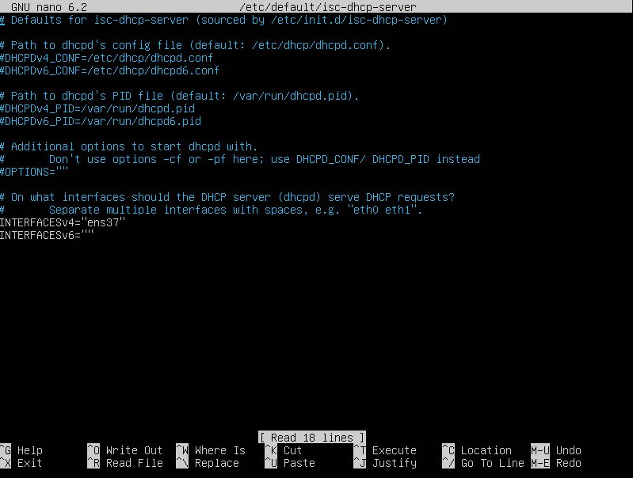
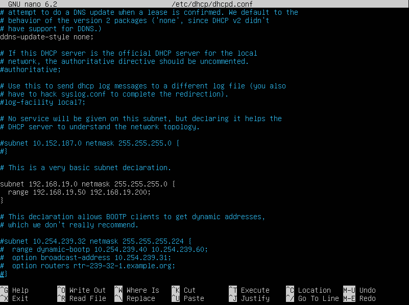

# INF0.2 - DHCP (Linux)

> **Powiązane notatki:**
> - [Netplan](./INF0.2%20-%20Netplan.md) — konfiguracja statycznego IP interfejsu
> - [DNS (BIND9)](./INF0.2%20-%20DNS%20-%20nie%20dzia%C5%82a.md) — konfiguracja serwera DNS

### 1. Instalacja
```bash
sudo apt install isc-dhcp-server
```

> **Ważne:** Serwer DHCP musi mieć **statyczny adres IP**. Nie może pobierać adresu przez DHCP.

### 2. Konfiguracja interfejsu
W tym pliku wybieramy na którym interfejsie (karcie sieciowej) serwer DHCP ma nasłuchiwać. Jeśli wpiszemy zły interfejs, DHCP nie będzie działać.

```bash
sudo nano /etc/default/isc-dhcp-server
```

Ustawiamy:
```ini
INTERFACESv4="eth0"
```



### 3. Konfiguracja strefy DHCP (dhcpd.conf)
W tym pliku przypisujemy "właściwą" konfigurację serwera — podsieć oraz zakres adresów, który będzie przydzielany komputerom w sieci.

```bash
sudo nano /etc/dhcp/dhcpd.conf
```

Przykładowa konfiguracja:
```text
subnet 192.168.19.0 netmask 255.255.255.0 {
    range 192.168.19.100 192.168.19.200;
    option domain-name-servers 192.168.19.1;
    option domain-name "zszz.local";
    option routers 192.168.19.1;
    option broadcast-address 192.168.19.255;
    default-lease-time 600;
    max-lease-time 7200;
}
```



Ważne: w polu `subnet` wpisujemy **adres sieci** (z końcówką `.0`), a nie adres hosta.

### 4. Rezerwowanie adresu dla wybranego komputera
W tym samym pliku (`dhcpd.conf`) możemy zarezerwować stały adres IP dla konkretnego urządzenia poprzez adres MAC:

```text
host fantasia {
    hardware ethernet 00:11:22:33:44:55;
    fixed-address 192.168.19.50;
}
```


### 5. Uruchomienie usługi
Dopiero po pełnej konfiguracji uruchamiamy serwer DHCP:

```bash
sudo systemctl restart isc-dhcp-server
sudo systemctl enable isc-dhcp-server
```

### 6. Sprawdzenie statusu
```bash
sudo systemctl status isc-dhcp-server
```

Jeśli są błędy, sprawdź logi:
```bash
sudo journalctl -u isc-dhcp-server -e
```
