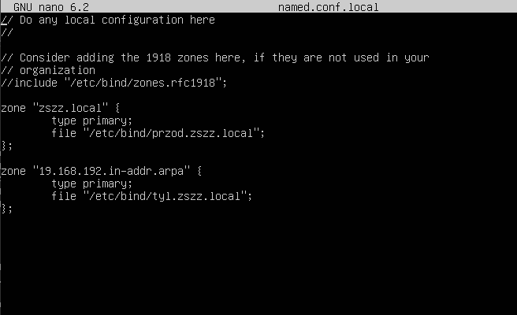
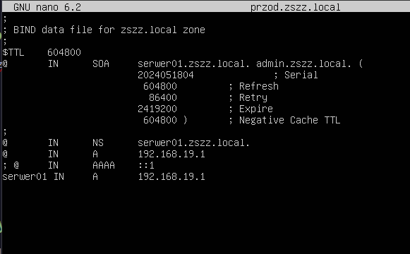
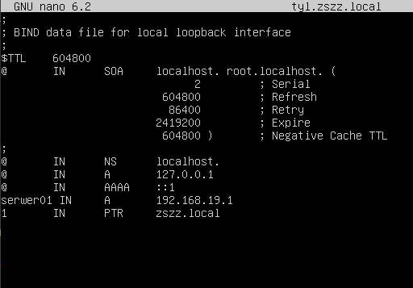
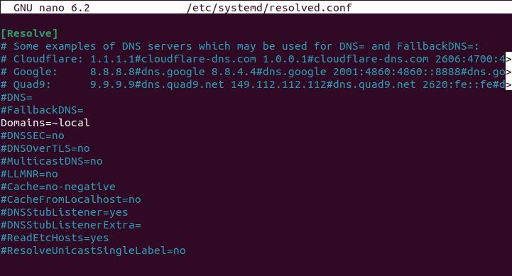
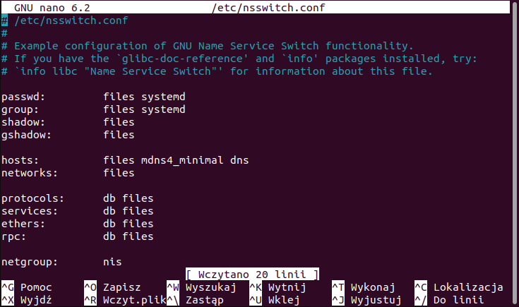

# INF0.2 - DNS (BIND9)

> **Powiązane notatki:**
> - [DHCP (Linux)](./INF0.2%20-%20DHCP%20%28Linux%29.md) — przydzielanie adresów i serwera DNS klientom
> - [Netplan](./INF0.2%20-%20Netplan.md) — konfiguracja statycznego IP serwera

### 1. Instalacja
```bash
sudo apt install bind9
```

### 2. Konfiguracja named.conf.local
```bash
sudo nano /etc/bind/named.conf.local
```

Dodajemy strefę wyszukiwania w przód i wstecz:
```text
zone "zszz.local" {
	type primary;
	file "/etc/bind/przod.zszz.local";
};

zone "19.168.192.in-addr.arpa" {
	type primary;
	file "/etc/bind/tyl.zszz.local";
};
```


### 3. Konfiguracja wyszukiwania w przód
```bash
sudo cp /etc/bind/db.local /etc/bind/przod.zszz.local
sudo nano /etc/bind/przod.zszz.local
```

Plik `db.local` zawiera nagłówek SOA. Należy go dostosować do naszej domeny:
- Zamień `localhost.` na `serwer.zszz.local.`
- Zamień `root.localhost.` na `admin.zszz.local.`
- Zaktualizuj numer seryjny (np. data YYYYMMDD01)

Na końcu pliku dodajemy rekord NS oraz rekordy A:
```text
	NS	serwer.zszz.local.
serwer	IN	A	192.168.19.1
```

Rekord NS jest wymagany — bez niego BIND odrzuci strefę.

Restart usługi:
```bash
sudo systemctl restart bind9
```


### 4. Konfiguracja wyszukiwania w tył
Szablonem dla strefy wstecznej jest `db.127`, nie plik strefy w przód — mają inną strukturę.
```bash
sudo cp /etc/bind/db.127 /etc/bind/tyl.zszz.local
sudo nano /etc/bind/tyl.zszz.local
```

Analogicznie dostosowujemy nagłówek SOA, a na końcu dodajemy rekord NS oraz rekord PTR:
```text
	NS	serwer.zszz.local.
1	IN	PTR	serwer.zszz.local.
```

Ważne: nazwa hosta w rekordzie PTR musi być pełną nazwą FQDN z **kropką na końcu** — bez niej BIND dokleja nazwę strefy i wynik jest błędny.

Restart usługi:
```bash
sudo systemctl restart bind9
```


### 5. Konfiguracja serwera DNS (resolved.conf)
Na Ubuntu z systemd-resolved należy ustawić adres serwera DNS w resolved.conf:
```bash
sudo nano /etc/systemd/resolved.conf
```

W sekcji `[Resolve]` odkomentowujemy i ustawiamy:
```text
DNS=192.168.19.1
```

Następnie restartujemy usługę:
```bash
sudo systemctl restart systemd-resolved
```


### 6. Konfiguracja nsswitch.conf
```bash
sudo nano /etc/nsswitch.conf
```

Usuń `[NOTFOUND=return]` i przenieś `dns` przed `mdns4_minimal`:
```text
hosts: files dns mdns4_minimal myhostname
```


### 7. Na stacji roboczej
Zmieniamy w ustawieniach karty sieciowej adres DNS na adres naszego serwera.

Test wyszukiwania w przód:
```bash
ping zszz.local
```

Test wyszukiwania w tył:
```bash
nslookup 192.168.19.1
```
