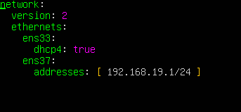

# INF0.2 - Netplan

> **Powiązane notatki:**
> - [DHCP (Linux)](./INF0.2%20-%20DHCP%20%28Linux%29.md) — serwer DHCP wymaga statycznego IP
> - [DNS (BIND9)](./INF0.2%20-%20DNS%20-%20nie%20dzia%C5%82a.md) — serwer DNS wymaga statycznego IP

### 1. Kopiowanie szablonu pliku
```bash
sudo cp /usr/share/doc/netplan/examples/static.yaml /etc/netplan/00-installer-config.yaml
```

### 2. Konfiguracja
`sudo nano /etc/netplan/00-installer-config.yaml`



### 3. Nadanie właściwych uprawnień
`sudo chmod 600 /etc/netplan/00-installer-config.yaml`

### 4. Sprawdzenie poprawności konfiguracji
```bash
sudo netplan try
sudo netplan apply
```

### Bonus: Konfiguracja Netplan dla wifi

```yaml
network:
  version: 2
  renderer: networkd
  wifis:
    wlp0s20f3:
      dhcp4: no
      addresses:
        - 192.168.1.114/24
      nameservers:
        addresses: [ 192.168.1.1, 9.9.9.9]
      routes:
        - to: default
          via: 192.168.1.1
      access-points:
        xxx:
          password:
```
